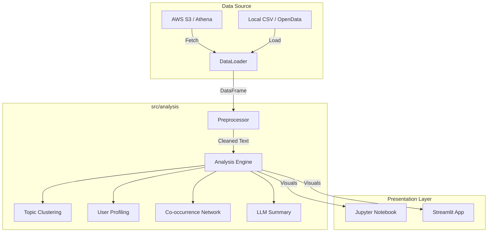
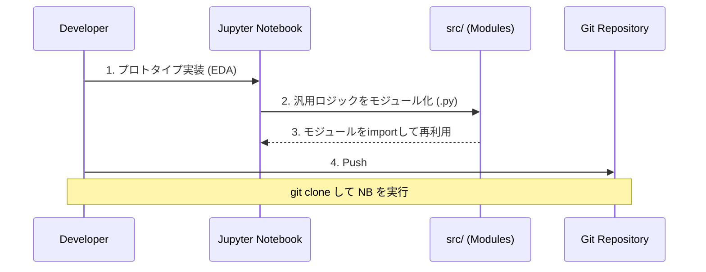

# Chat Log Analyzer (ai-chat-analyzer)

AIキャラクターとユーザーの会話ログを分析し、インサイトを導出するためのPythonフレームワークです。
会話ログデータとユーザー属性データを掛け合わせ、「会話単位」「ユーザー単位」「単語単位」の多角的な視点から分析・可視化を行います。

## 1. Overview

本プロジェクトは、AWS Athena (S3) やCSVファイルから会話ログを読み込み、テキストマイニング技術を用いて動的なダッシュボードを構築することを目的としています。

**主な特徴:**
* **データソース非依存:** データ取得ロジックを抽象化し、S3/AthenaでもローカルCSVでも同様に扱えます。
* **多層分析:** 形態素解析、共起分析、ベクトル化、クラスタリング、LLM要約をサポート。
* **ポータビリティ:** `git clone` と `pip install` だけで動作し、Docker等の複雑な環境構築を必要としません。

### Architecture Overview



## 2. Features

### 2.1 Data Ingestion

開発用データセットとして、ユーザー属性を含む **`nu-dialogue/real-persona-chat`** (Hugging Face) に標準対応しています。
本番環境では AWS Athena から取得したデータを同様の DataFrame 形式に変換して処理します。

### 2.2 Analysis Capabilities

| Level | Analysis Type | Description |
| --- | --- | --- |
| **Word** | 共起分析 | 単語間のネットワーク図を描画し、話題の構造を可視化 |
| **Session** | クラスタリング | 会話トピックの自動分類（K-means / Embeddings） |
| **Session** | LLM要約 | 会話ログ全体の要約生成 |
| **User** | プロファイリング | 属性（年代・性別）ごとの発言傾向分析 |
| **User** | ベクトル化 | 全会話履歴をベクトル化し、類似ユーザーを特定 |

### 2.3 Visualization

`matplotlib` と `plotly` を採用し、日本語を含むリッチなグラフ描画が可能です。

## 3. Directory Structure

ロジック（`src`）とプレゼンテーション（`notebooks`）を分離した構成です。

```text
ai-chat-analyzer/
├── data/                  # データ格納用 (.gitignore)
│   ├── raw/               # 元データ (Athenaエクスポート or OpenData)
│   └── processed/         # 前処理済みデータ
├── notebooks/             # 分析ダッシュボード (Jupyter)
│   ├── 01_overview.ipynb  # 基本統計・データ確認
│   ├── 02_user_analysis.ipynb # 属性別分析・プロファイリング
│   └── 03_topic_clustering.ipynb # トピック分析・共起ネットワーク
├── src/                   # ソースコード
│   ├── __init__.py
│   ├── config.py          # 設定ファイル
│   ├── loader/            # データ読み込み
│   │   ├── base_loader.py
│   │   ├── csv_loader.py
│   │   └── huggingface_loader.py # nu-dialogue用
│   ├── preprocessor/      # 前処理
│   │   ├── text_cleaner.py
│   │   └── tokenizer.py   # MeCab/UniDic
│   ├── analysis/          # 分析ロジック中核
│   │   ├── clustering.py
│   │   ├── cooccurrence.py
│   │   ├── vectorizer.py
│   │   └── llm_wrapper.py
│   └── visualization/     # 描画モジュール
│       ├── charts.py
│       └── plot_utils.py
├── requirements.txt
├── .gitignore
└── README.md

```

## 4. Installation

### Prerequisites

* Python 3.10+
* (Optional) OpenAI API Key (LLM機能利用時)

### Setup Steps

1. **Clone the repository**
```bash
git clone <repository_url>
cd ai-chat-analyzer

```


2. **Create Virtual Environment**
```bash
python -m venv venv

# Windows
.\venv\Scripts\activate
# Mac/Linux
source venv/bin/activate

```


3. **Install Dependencies**
```bash
pip install -r requirements.txt

```

### ⚠️ 環境構築時の注意事項

以下の問題が発生した場合の対処法です：

#### 1. UMAP/Numbaコンパイルエラー
**症状:** `LLVMPY_ParseAssembly` エラーでプロセスがハング

```
KeyboardInterrupt: ... LLVMPY_ParseAssembly ... llvmlite ...
```

**原因:** UMAP の JIT コンパイラ（Numba）と LLVM の互換性問題（特に Windows/Python 3.10で発生）

**対処:**
- UMAP使用を避け、PCA等の代替実装を使用
- `src/visualization/visualizer.py` にはフォールバック実装済み（UMAP失敗時→PCA）
- 本ノートブックでもPCAをデフォルトで使用しています

#### 2. MeCab/Janome トークン化エラー
**症状:** `ModuleNotFoundError: No module named 'janome'`

```bash
pip install janome
```

**症状:** `MeCab.Tagger() 初期化失敗`
- Windows: `pip install mecab-python3` の後、MeCab本体インストール必要
- 代替: `janome` ライブラリを使用（Python純粋実装）

#### 3. HDBSCANインストール失敗
**症状:** `pip install hdbscan` が失敗する（ビルドエラー）

```bash
# Windows環境では事前コンパイル版をインストール
pip install hdbscan --only-binary :all:
```

#### 4. ターミナル/Jupyter が反応しなくなる
**症状:** UMAP/大量データ処理時にメモリ枯渇やプロセスハング

**対処:**
```bash
# プロセスを強制終了
# Windows PowerShell
Stop-Process -Name python -Force

# Linux/Mac
pkill -f python
```

#### 5. 推奨環境設定
```bash
# 仮想環境は必須（依存関係の競合を避けるため）
python -m venv venv
source venv/bin/activate  # or ./venv/Scripts/activate (Windows)

# キャッシュをクリアしてインストール
pip install --no-cache-dir -r requirements.txt

# 特に問題が多い場合は一度クリア
pip cache purge
```


## 5. Usage

### Quick Start (Dev Mode)

開発用データセット(`nu-dialogue/real-persona-chat`)を自動ダウンロードして分析を開始します。

```bash
# Jupyter Labを起動
jupyter lab

```

`notebooks/01_overview.ipynb` を開き、セルを実行してください。

### Data Schema

分析に使用する DataFrame は以下のスキーマを想定しています。

| Column | Type | Description |
| --- | --- | --- |
| `timestamp` | datetime | 発話日時 |
| `user_id` | str | ユーザーID |
| `speaker` | str | `User` or `System` |
| `text` | str | 発話内容 |
| `attribute_age` | str | (Optional) ユーザー年代 |
| `attribute_gender` | str | (Optional) ユーザー性別 |

## 6. Development Workflow



# requirements.txt

```text
pandas>=2.0.0
numpy>=1.24.0
matplotlib>=3.7.0
seaborn>=0.12.0
plotly>=5.15.0
japanize-matplotlib>=1.1.3
wordcloud>=1.9.0
mecab-python3>=1.0.6
unidic-lite>=1.0.8
scikit-learn>=1.3.0
sentence-transformers>=2.2.2
transformers>=4.30.0
torch>=2.0.0
networkx>=3.1
openai>=1.0.0
python-dotenv>=1.0.0
tqdm>=4.65.0
jupyterlab>=4.0.0
ipykernel>=6.25.0
datasets>=2.14.0

```
